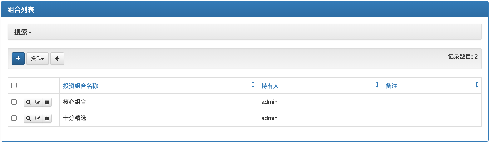
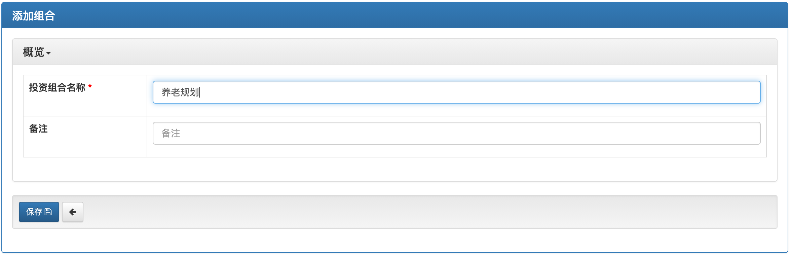
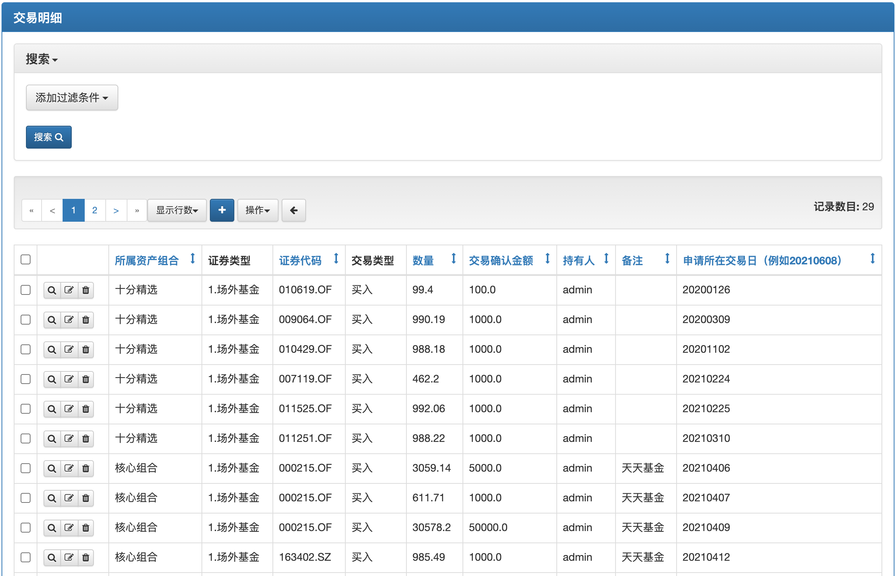

# 组合管理
## 组合列表
该功能用于创建修改投资组合。用户可以为自己创建多个不同的组合，既可以是不同风险等级的，如谨慎组合、稳健组合、平衡组合、进取组合、激进组合；也可以是不同用途的，如教育储备、养老规划等，组合名称随意。

点击上图的+号，添加投资组合。

## 交易明细
该功能用于添加修改投资组合交易记录，包括购买和赎回

下图中有bug：下拉列表中没有按照用户所拥有的投资组合过滤，交易日期的格式没有校验，证券代码也没有校验，没有作为外键关联，输入不方便。
